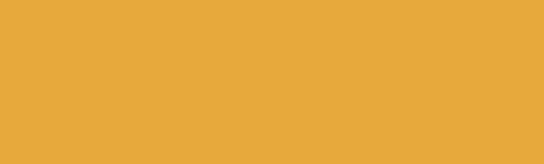
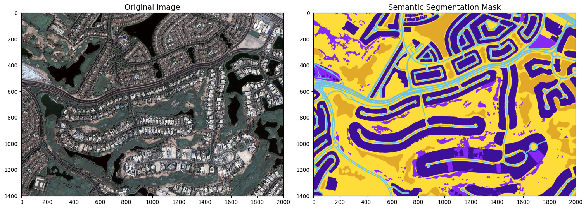
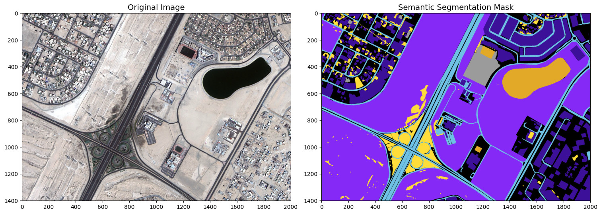
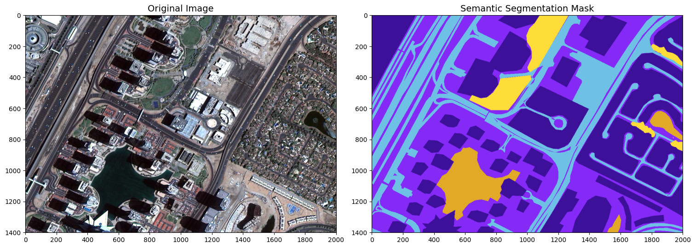
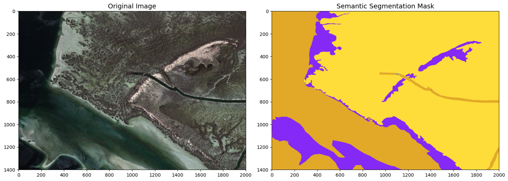

# Dubai Satellite Imagery Semantic Segmentation Using Deep Learning

Fork [README](https://github.com/prodramp/DeepWorks/blob/main/README.md)

## Dataset
[Humans in the Loop](https://humansintheloop.org/) has published an open access dataset annotated for a joint project with the [Mohammed Bin Rashid Space Center](https://www.mbrsc.ae/) in Dubai, the UAE.
The dataset consists of aerial imagery of Dubai obtained by MBRSC satellites and annotated with pixel-wise semantic segmentation in 6 classes.
The images were segmented by the trainees of the Roia Foundation in Syria.

### Semantic Annotation

The images are densely labeled and contain the following 6 classes:

| Name       | R   | G   | B   | Color                                                                                              |
| ---------- | --- | --- | --- | -------------------------------------------------------------------------------------------------- |
| Building   | 60  | 16  | 152 | 

   |
| Land       | 132 | 41  | 246 | 

       |
| Road       | 110 | 193 | 228 | 

       |
| Vegetation | 254 | 221 | 58  | 

 |
| Water      | 226 | 169 | 41  | 

      |
| Unlabeled  | 155 | 155 | 155 | 

  |

### Sample Images & Masks

